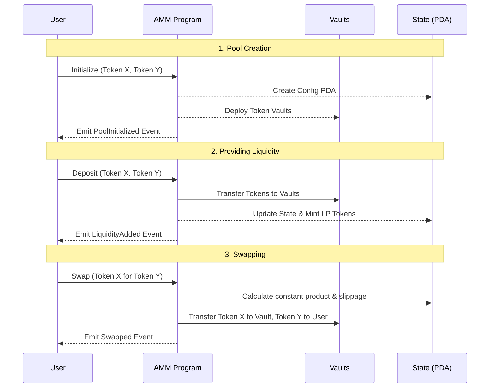

# Quasar AMM

A minimal, high-performance Automated Market Maker (AMM) built for Solana using the [Quasar](https://github.com/blueshift-gg/quasar) framework. This program serves as a constant-product decentralized exchange—much like a lightweight Uniswap V2 or Raydium—optimized for speed by running in a `no_std` environment.

## What's Inside

This repo contains the smart contracts for a fully functional on-chain liquidity pool. It features everything you'd need to spin up a pair, provide liquidity, and immediately start facilitating swaps. By bypassing standard library overheads, it keeps compute costs down and execution speed up.

### Core Instructions
- **Initialize**: Spin up a new pool for any two target tokens. Sets the baseline fee and lock status.
- **Deposit**: Add Token X and Token Y to the pool. In return, the sender mints LP (Liquidity Provider) tokens.
- **Withdraw**: Burn LP tokens to claim back a proportional share of the underlying Token X and Token Y.
- **Swap**: The main event. Trade Token X for Token Y (or vice-versa), respecting the classic `x * y = k` invariant and user-defined slippage limits.
- **Toggle Pool**: Enables a designated authority to lock or unlock the pool, pausing deposits and swaps if an issue is detected.

## Architecture & Flow

Here's an overview of how users interact with the AMM:

## Project Structure

- `src/instructions/` - Houses the business logic for all AMM state transitions (Initialize, Deposit, Withdraw, Swap, Toggle).
- `src/state/` - Defines the `Config` PDA that tracks the pool's settings, mints, and current authority.
- `src/events/` - Solana accounts don't store historical state, so the program emits discrete events for frontend ingestion (e.g., `PoolInitialized`, `Swapped`).
- `src/errors/` - Custom AMM errors, handling situations like slippage limits, invalid balances, and curve math overflows.

## Development

The project is built specifically for the `quasarsvm-rust` testing framework.

**Prerequisites**
- Rust (standard Solana toolchain)
- The [Quasar framework](https://github.com/blueshift-gg/quasar) dependencies.

Since it operates gracefully under `no_std`, make sure not to import anything from standard libraries that allocate heap memory unless strictly necessary.

* * *
*If you're building an indexer or UI, rely heavily on the events emitted in `src/events/mod.rs`—they represent the single source of truth for the pool's history.*
